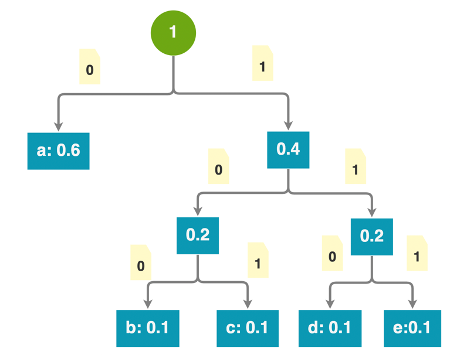

# Huffman Compressor

哈夫曼压缩/解压缩器，是JLU的数据结构作业。

## Running Snapshot

[](https://asciinema.org/a/3odwcknzw6MeGnEpdD2IHtrNW)

## Design

### File Structure

The file compressed will be end of .huff, which contains header like below:

#### Header
```
     0                   1                   2                   3
     0 1 2 3 4 5 6 7 8 9 0 1 2 3 4 5 6 7 8 9 0 1 2 3 4 5 6 7 8 9 0 1  32 bits
0   +---------------+---------------+---------------+---------------+ 0
    |                          Magic Number                         |
4   +---------------+---------------+---------------+---------------+ 32
    | VersionNumber |      Type     |           Trie Length         |
8   +---------------+---------------+---------------+---------------+ 64
    |                         Source Length                         |
12  +---------------+---------------+---------------+---------------+ 96
    |                         Source Length                         |
16  +---------------+---------------+---------------+---------------+ 128
    |                          CRC32 Code                           |
20  +---------------+---------------+---------------+---------------+ 160
    |                           Reserved                            |
24  +---------------+---------------+---------------+---------------+ 192
    |                           Reserved                            |
30  +---------------+---------------+---------------+---------------+ 224
    |                           Reserved                            |
32  +---------------+---------------+---------------+---------------+ 256
    |                           Reserved                            |
36  +---------------+---------------+---------------+---------------+ 288 bits
byte 0 1 2 3 4 5 6 7 0 1 2 3 4 5 6 7 0 1 2 3 4 5 6 7 0 1 2 3 4 5 6 7  4 bytes
```

In this:
- Magic Number: A magic number, it is always 0x01711EF3, 0b0001 0111 0001 0001 1110 1111 0011.
- Version Number: A version number of this huff file, now it should be 0b0000 0001, which is 1.
- Type: The length of bits of Huffman codec.
- Trie Length: The length of huffman trie structure.
- Source Length: The length of file of the uncompressed, the full file. 
It takes 8 bytes which is a 2^64 bits gigantic number. It will support up to 2.4 x 10^5 TB. 
Just pay attention to the concatenate operation: the upper 32 bit is the upper field in the file.
- Reserved: No use at now, should be all 0.
- CRC32 Code: The CRC32 code of the original file, should check it after decompression.

**Because these headers is useless and unnecessary, the program will count compression rate without header.**

#### Content
The construction of trie is below.
For example, there are 5 characters a, b, c, d and e, with frequency of
0.6, 0.1, 0.1, 0.1, 0.1. This bushy tree is just like this:



The prefix free codec table is:

| Character | Codec in Binary |
|:---------:|:---------------:|
|     a     |    00000000     |
|     b     |    00000100     |
|     c     |    00000101     |
|     d     |    00000110     |
|     e     |    00000111     |

In the beginning of content, there is a bit for indicating this leaf is a true leaf,
or just another parent of other leaves.

So, the binary structure of this tree is:
```
 0                   1                   2                   3
 0 1 2 3 4 5 6 7 8 9 0 1 2 3 4 5 6 7 8 9 0 1 2 3 4 5 6 7 8 9 0 1  32 bits
+-+-+-+-+-+-+-+-+-+-+-+-+-+-+-+-+-+-+-+-+-+-+-+-+-+-+-+-+-+-+-+-+
|1|ASCII 'a' in bin |0 0 0 0 0 0 0 0 0|0|0|1|ASCII 'b' in bin |0|
+-+-+-+-+-+-+-+-+-+-+-+-+-+-+-+-+-+-+-+-+-+-+-+-+-+-+-+-+-+-+-+-+
|0 0 0 0 1 0 0|1|ASCII 'c' in bin |0 0 0 0 0 1 0 1|0|1|ASCII 'd'|
+-+-+-+-+-+-+-+-+-+-+-+-+-+-+-+-+-+-+-+-+-+-+-+-+-+-+-+-+-+-+-+-+
|in bin |1|0 0 0 0 0 1 1 0|ASCII 'e' in bin |0 0 0 0 0 1 1 1|0 0|
+-+-+-+-+-+-+-+-+-+-+-+-+-+-+-+-+-+-+-+-+-+-+-+-+-+-+-+-+-+-+-+-+
|                     Compressed File Content                   |
+-+-+-+-+-+-+-+-+-+-+-+-+-+-+-+-+-+-+-+-+-+-+-+-+-+-+-+-+-+-+-+-+
 0 1 2 3 4 5 6 7 0 1 2 3 4 5 6 7 0 1 2 3 4 5 6 7 0 1 2 3 4 5 6 7  4 bytes
```
Actually, the program won't distinguish the character is ASCII or not indeed.
It compresses binary straightly (Same effect to ASCII).

In English, the content structure is started by 0 or 1, which is represented to
this node is the leaf node or not, then followed by content -- the key of the map,
finally ended with n bits (here is 8) wide huffman codec -- the value of the map.

And next to the pending bits, there is actual compressed file content, which wouldn't
end with pending because before compressed file content, they are already aligned by bytes.

### Modules
#### Bit Operation
##### Output
I designed a class that can print bits/bytes to output stream, also a file.
It is simply to use, just like this:

```java
BitsOut bo = new BitsOut(); // default is System.out
BitsOut bo2 = new BitsOut("/home/evyde/", "test.out");
BitsOut bo3 = new BitsOut(new ByteArrayOutputStream());

bo.write(33333); // write int
bo2.write(true); // write bit
bo3.write((byte) 2); // write byte
bo.write(0b111, 3); // write 3bit of int
bo2.write(new Bits(new BigInteger("1234567890ABCDEF"))); // write bits in BigInteger
bo3.write(new Bits("01111", 127)); // write bits in Bits

bo.close(); // close and flush
bo2.close();
bo3.close();
```

It nicely uses abstracted "stream" as the output and process bit-wise things.

##### Input
Same as the output, this BitsOut class has an InputStream-like interface.
Usage:
```java
BitsIn bi = new BitsIn(); // default is System.in
BitsIn bi2 = new BitsIn("/home/evyde/", "test.in");
BitsIn bi3 = new BitsIn(new ByteArrayInputStream());

bi2.readBooleanBits(3); // read bits in boolean array
bi3.read(2); // read bits in Bits
bi.readByte(); // read byte

bi.close(); // close
bi2.close();
bi3.close();
```

##### Bits
This Bits class is like BigInteger in Java, it uses boolean array as inherent storage.
It can take string, integer, BigInteger as parameter and can specify bits length and can be compared with other Bits.

See BitsTest.java for more usage example.

## License

AGPLv3, see LICENSE file to get more information.
